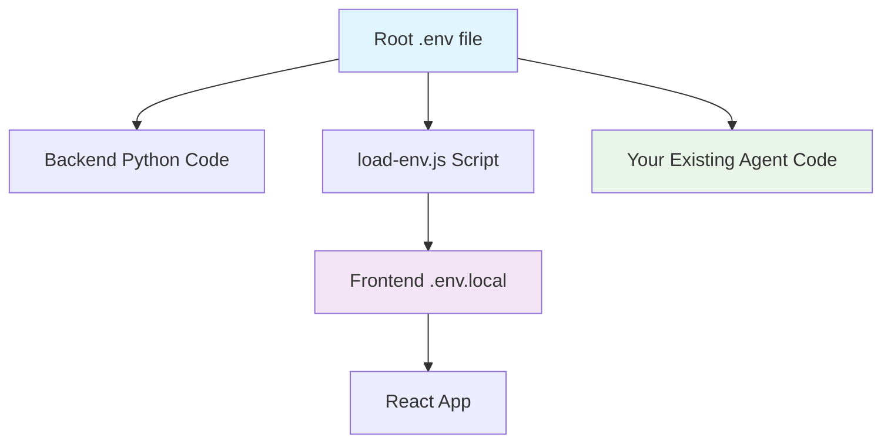

# Unified Environment Configuration

The Invoice Chat Interface uses a **single `.env` file** at the project root to configure both the backend and frontend. This approach ensures consistency and simplifies management.

## 📁 File Structure

```
Invoice-Reconciliation-Agent/
├── .env                     # ← Single environment file (you create this)
├── .env.example             # ← Template file (copy to .env)
├── backend/
│   ├── app/
│   │   └── core/config.py   # ← Loads from root .env
│   └── start_server.py      # ← Loads from root .env
├── frontend/
│   ├── load-env.js          # ← Extracts REACT_APP_* from root .env
│   └── package.json         # ← Runs load-env.js before start/build
└── agent/                   # ← Your existing agent code
```

## 🔄 How It Works

### Backend Configuration
- `backend/app/core/config.py` automatically loads variables from the root `.env` file
- `backend/start_server.py` also loads from root `.env` as a fallback
- All backend settings (API, database, models) come from the root file

### Frontend Configuration  
- `frontend/load-env.js` extracts `REACT_APP_*` variables from root `.env`
- Creates `frontend/.env.local` with only the frontend-relevant variables
- React automatically loads these variables during build/start

### Variable Flow



## 📝 Environment Variables

### Existing Variables (Keep Your Values)
```bash
# Your existing Supabase configuration
SUPABASE_URL=your_existing_value
SUPABASE_KEY=your_existing_value
SUPABASE_DB_HOST=your_existing_value
# ... other existing variables
```

### New Chat Interface Variables
```bash
# Backend API Settings
ENVIRONMENT=development
HOST=0.0.0.0
PORT=8000
CORS_ORIGINS=http://localhost:3000

# Frontend Settings (REACT_APP_ prefix required)
REACT_APP_API_URL=http://localhost:8000/api/v1
REACT_APP_WS_URL=ws://localhost:8000

# File Upload
MAX_FILE_SIZE=10485760
UPLOAD_DIR=uploads

# Model Configuration
OLLAMA_BASE_URL=http://localhost:11434
DEFAULT_MODEL=llama3.2

# Optional Cloud APIs
OPENAI_API_KEY=
ANTHROPIC_API_KEY=
```

## 🚀 Quick Setup

1. **Copy the template:**
   ```bash
   cp .env.example .env
   ```

2. **Edit with your values:**
   ```bash
   # Keep your existing Supabase settings
   # Add new chat interface settings
   ```

3. **Start backend:**
   ```bash
   cd backend
   python start_server.py
   ```

4. **Start frontend:**
   ```bash
   cd frontend
   npm start  # Automatically loads from root .env
   ```

## ✅ Benefits

- **Single Source of Truth**: All configuration in one place
- **No Duplication**: No need to maintain separate `.env` files
- **Consistency**: Backend and frontend always use compatible settings
- **Simplified Deployment**: One file to configure for all components
- **Backward Compatible**: Your existing agent code continues to work

## 🔧 Advanced Configuration

### Different Environments
You can create environment-specific files:
- `.env.development` - Development settings
- `.env.production` - Production settings
- `.env.local` - Local overrides (git-ignored)

### Custom Port Configuration
```bash
# To run on different ports
PORT=8080
REACT_APP_API_URL=http://localhost:8080/api/v1
REACT_APP_WS_URL=ws://localhost:8080
```

### Multiple Frontend URLs
```bash
# For multiple frontend instances
CORS_ORIGINS=http://localhost:3000,http://localhost:3001,http://127.0.0.1:3000
```

## 🛠️ Troubleshooting

### Environment Variables Not Loading
1. Check that `.env` file exists in project root
2. Verify variable names (frontend needs `REACT_APP_` prefix)
3. Restart both backend and frontend after changes
4. Check console for loading messages

### Frontend Can't Connect to Backend
1. Verify `REACT_APP_API_URL` matches backend address
2. Check `CORS_ORIGINS` includes frontend URL
3. Ensure backend is running on correct port

### Backend Configuration Issues
1. Check root `.env` file exists and is readable
2. Verify Python dotenv package is installed
3. Check for syntax errors in `.env` file (no spaces around `=`)

This unified approach makes the Invoice Chat Interface easier to configure and maintain while preserving compatibility with your existing setup! 🎉